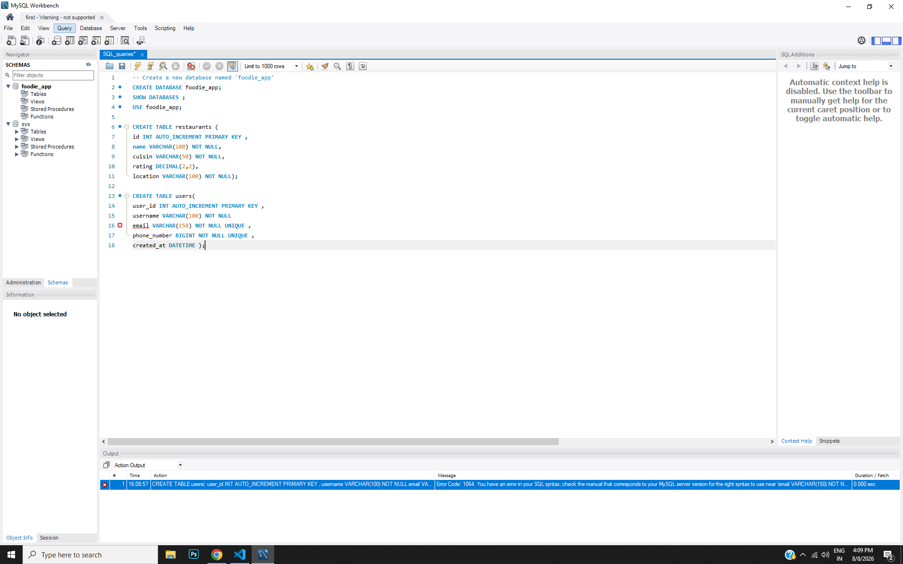

## Q.1 Create a new database named 'foodie_app' 
```sql CREATE DATABASE foodie_app;
USE foodie_app;```

## Q.2 Write a CREATE TABLE statement to define a 'restaurants' table in the 'foodie_app' database with the following columns: id (integer, primary key), name (varchar/character, max 100), cuisine (varchar/character, max 50), rating (decimal, e.g., 4.5), and location (varchar/character, max 100).

```sql CREATE TABLE restaurants (
   id INT AUTO_INCREMENT PRIMARY KEY ,
   name VARCHAR(100) NOT NULL,
   cuisin VARCHAR(50) NOT NULL,
   rating DECIMAL(2,2),
   location VARCHAR(100) NOT NULL);
```
## Q.3 Design and create a 'users' table for a Flipkart-style app with columns: user_id (primary key), username, email, phone_number, and created_at (date/time). Pick appropriate data types for each column. Think about which columns should be unique and which data types best fit email and phone numbers.
  
```sql CREATE TABLE users( 
  user_id INT AUTO_INCREMENT PRIMARY KEY ,
  username VARCHAR(100) NOT NULL,
  email VARCHAR(150) NOT NULL UNIQUE ,
  phone_number BIGINT NOT NULL UNIQUE ,
  created_at DATETIME );
```
##Q.4 intentionally make a mistake in your CREATE TABLE statement (such as missing a comma or using an unsupported data type), run it, and then fix the error based on the message you receive. Take a screenshot of the error and the corrected SQL statement for your records.
```sql CREATE TABLE users( 
  user_id INT AUTO_INCREMENT PRIMARY KEY ,
  username VARCHAR(100) NOT NULL
  email VARCHAR(150) NOT NULL UNIQUE ,
  phone_number BIGINT NOT NULL UNIQUE ,
  created_at DATETIME );
```
  

 ## **correted quary**
```sql CREATE TABLE users( 
user_id INT AUTO_INCREMENT PRIMARY KEY ,
username VARCHAR(100) NOT NULL,
email VARCHAR(150) NOT NULL UNIQUE ,
phone_number BIGINT NOT NULL UNIQUE ,
created_at DATETIME ); 
```
