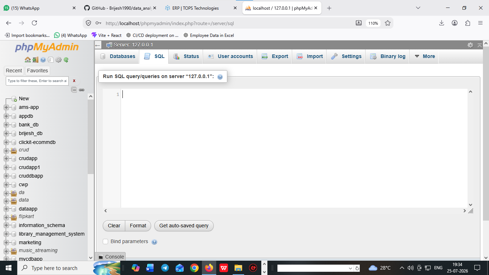
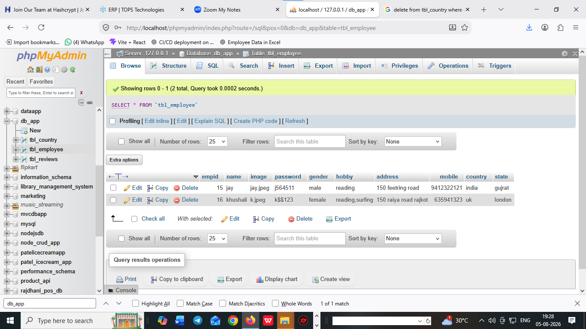

# What is  SQL and database ?

## what is SQL ?

- A SQL stands for structured query language
- A SQL is used to create a database and table structured 
- A SQL is used to create a structured data 
- A SQL is case-insenstive language
- insenstive language examples : INSERT | insert | Insert 


# what is Database ? 

- A database is used to stored an infomations i.e called database 
- List out 5 name of database 
1. oracle
2. mysql 
3. sqlite 
4. sql server
5. mongoDB


## how to open xampp 

1. xampp=>control panel=>start 

2. localhost/phpmyadmin





## how to open mySQLworkbench8.0

1. https://dev.mysql.com/downloads/workbench/
2. open mysqlworkbench
3. create an database instance

 


## what is difference b/w SQL and MYSQL 

## SQL

1. sql is an structured query language 
2. sql is case insenstive language
3. sql is create database and tables structured 

## MySQL

1. mysql is an database 
2. mysql is case senstive language
3. mysql is used to stored data 


# what is DBMS ? 
1. DBMS stands for database management system 
2. DBMS is used to manage databases 
1. oracle
2. mysql 
3. sqlite 
4. sql server
5. mongoDB

# what is RDBMS ? 
1. RDBMS stands for relational database managment system 
2. RDBMS provides relations b/w database and its tables 
3. RDBMS manage GUI of database 


## types SQL commands 

- DDL (data definition langauge)
- DML (data manipulation language)
- DQL (data query language)
- TCL (transanctional control language)


## DDL (data definition language) : 

- A DDL is used to create database and table definition 
- A DDL is used to create database name and table name and its structures 
- A DDL query are ....

1. create
2. alter 
3. rename
4. change
5. drop 
6. truncate 

## how to create database ? 

**syntax**

```
create database databasename;
or
create database db_app; 
``` 

## how to create table  ?

**table datatype and size structures**

# SQL Table Structure

| Column Name | Data Type | Size | Description |
|-------------|-----------|------|-------------|
| ID | INT | 11 | Primary Key (auto_increment) |
| FirstName | VARCHAR | 0-255 | Employee first name |
| LastName | VARCHAR | 0-255 | Employee last name |
| Email | VARCHAR | 255 | Email address |
| Phone | VARCHAR | 20 | Contact number |
| DateOfBirth | DATE | - | Birth date |
| Salary | DECIMAL | 10,2 | Employee salary |
| IsActive | BIT | 1 | Active status |
| CreatedDate | DATETIME | - | Record creation date |
| UpdatedDate | DATETIME | - | Last update date |
| address     | text     |  for more text   |
| multiple choice | enum |  for multiple choices |
| mobile | bigInt | 20 | for bigInt   |
| photo  | blob   | bigsize           |
| defaulttimezone  | timestamp   | default timezone set time and date           |


**syntax**

```
create table tablename(
id int auto_increment primary key,
name varchar(255),
password varchar(255),
mobile bigInt,
address text,
appointmentdate_time datetime
);
or

create table users(
id int auto_increment primary key,
name varchar(255),
password varchar(255),
mobile bigInt,
address text,
appointmentdate_time datetime
);

or

create table employee(
empid int AUTO_INCREMENT primary key,
name varchar(255),
password varchar(255),
gender varchar(255),
hobby varchar(255),
address text,
phone bigint    

)

or

create table tbl_salesman(

id int AUTO_INCREMENT primary key,
name varchar(255),
age int,
mobile bigint,
address text,
salary decimal(10,2),
department varchar(255),
create_at timestamp


)

``` 

## alter

1. alter is used to add new column in a table
2. alter is used to modify or add or update new column in tables
3. alter also create a unique key in column.
4. alter tables add column | modify column | update column in tables

**syntax**

```
alter table tablename add columnname datatype(size)
or
alter table employee add country varchar(255)
or
alter table employee add state varchar(255)
or
alter table employee add photo blob after name;
or
alter table employee change phone mobile bigint;
or
alter table employee add unique(`mobile`)
or 
alter table tbl_employee change photo image varchar(200);

```


## drop : 

1. drop is used to delete or drop a database or table structures 
2. drop is delete structures of database and tables 
3. after drop we never rollback structures and data 


**syntax**

```
drop database databasename
or
drop database db_app;

drop table tablename
or
drop table employee
or
drop table users

```

## truncate :

1. truncate is used to delete or remove all data from from tables 
2. truncate is used to empty all data from tables 
3. after truncate we never rollback data 

**syntax**

```
truncate table tablename
or
truncate table employee
```

## rename :

1. rename is used to change any table name 

**syntax**

```
rename table employee to tbl_employee

```


## revised....
**create a table tbl_reviews with following column name**

```
tbl_reviews 

rid
name
email
phone
rating 
comment

or

create table tbl_reviews(
rid int AUTO_INCREMENT primary key,
name varchar(255),
email varchar(255),
phone bigint,
rating enum('*','**','***','****','*****'),
comment text    

) 


```

## DML : data manipulation language 

1. DML is used to manipulate data in tables 
2. DML is used to insert | delete | update data in tables 
3. DML used for manipulation of data 

**query used in DML**

1. insert 
2. delete 
3. update 

## how to insert data in tables
**syntax**

```
insert into tablename(columnname) values('value')
or 
insert into tbl_employee(name,image,password,gender,hobby,address,mobile,country,state)values('kumar','kumar.jpg','k515454','male','read,playing','150 feet ring road rajkot',91212121,'india','gujrat')

or

insert into tbl_employee(name,image,password,gender,hobby,address,mobile,country,state)values('deep','deep.jpg','k515454','male','read,playing','150 feet ring road rajkot',97212121,'india','gujrat'),('lokesh','lokesh.jpg','k515454','male','read,playing','150 feet ring road rajkot',91214121,'india','gujrat'),('sumya','sumya.jpg','k515454','male','read,playing','150 feet ring road rajkot',91212521,'india','gujrat')

or

insert into tbl_employee values(null,'jay','jay.jpeg','j564511','male','reading','150 feetring road',9412322121,'india','gujrat'),(null,'vijay','vijay.jpeg','j564511','male','reading','150 feetring road',9412322121,'india','gujrat')

```

# how can we delete data 

1. all data delete from tables 

```
delete from tablename
or
delete from tbl_employee;
```

2. delete one rows from table 

```
delete from tablename where id=1;
or
delete from tbl_employee where empid=1;

```

3. delete  two or more than two rows from table 

```
delete from tablename where id in(5,6);
or

delete from tbl_employee where empid in(5,6)

```

4. delete  range of data from table 

```
delete from tablename where id between 5 and 12;
or

delete from tbl_employee where empid between 5 and 12;

```

5. delete from name column data from table

``` 
delete from tbl_country where name='europe';
```

6. delete data or rows using limit 

```
delete from tbl_country where cid > 0 limit 4;
```  


# update a data or rows 

1. update rows 

```
update tbl_employee set name='khushali',image='k.jpeg',password='k$$123',gender='female',hobby='reading,surfing',address='150 raiya road rajkot',mobile=635941323,country='uk',state='london' where empid=16

```

**screenshot**




## DQL :

1. data query language 
2. DQL is used to select data or fetch data 

## DQL query 

1. select 

**fetch data or select data**

- select all data from tables

```
select * from tbl_employee;
```

- select particular one data from tables

```
select * from tbl_employee where empid=5;
```


- select particular alternate data  from tables

```
select * from tbl_employee where empid in (5,6,9);
```

- select particular range of data   from tables

```
select * from tbl_employee where empid between 1 and 100;
```


- select particular columns of  data  from tables

```
select empid,name,email from tbl_employee;
```


- select particular data using limit  from tables

```
select empid,name,hobby from tbl_employee where limit 3,5;
or
select * from tbl_country where cid limit 4,1;
```

# order by : 

1. order by is used to filter data in asc and desc order

```
select * from tbl_country order by cid;
or
select * from tbl_country order by cid asc;
or 
select * from tbl_country order by cid desc;


```

# group by :

1. group by is used to grouping or filters data on group of columns 

```
select sum(salary),department as sumof_salary from tbl_employee group by department;
```

# alias of column name

1. alias is nick name of columns 

```
select count(empid) from tbl_employee;
or
select count(empid) as numbers_of_employees from tbl_employee;

```

# SQL function :
1. SQL provides its inbuilt function
2. SQL functions are 

- Aggrigate function
- sum()
- avg()
- count()
- max()
- min()

- Scalar function
- first()
- last()
- lcase()
- ucase()
- now()
- datetime()
- timestamp()


# SQL functions queries...

1. select sum(salary) as sum_of_salary from tbl_employee;
2. select avg(salary) as avg_of_salary from tbl_employee;   
3. select count(empid) as total_numbers_employee from tbl_employee;
4. select max(salary) as highest_salary from tbl_employee;
5. select min(salary) as minium_salary from tbl_employee;


# subquery :  

1. subquery is used query within another query i.e called subquery

```
select max(salary) as second_highest_salary from tbl_employee where salary < (select max(salary) from tbl_employee)

or

SELECT MAX(salary) AS second_highest_salary FROM tbl_employee
WHERE salary < (SELECT MAX(salary) FROM tbl_employee WHERE salary < (SELECT MAX(salary) FROM tbl_employee where  salary < (select max(salary) from tbl_employee)));

or 


SELECT MAX(salary) AS second_highest_salary FROM tbl_employee
WHERE salary < (SELECT MAX(salary) FROM tbl_employee WHERE salary < (SELECT MAX(salary) FROM tbl_employee where  salary < (select max(salary) from tbl_employee)));

``` 

2. select * from tbl_employee order by salary desc limit 1,1;

3. select * from tbl_employee order by salary desc limit 2,1;   


# SQL like operator ? 

  1. searching the data from tables via its **words** or **wildcard**
  2. searching data from tables used like 

  ```
  select * from tbl_employee where name like 't%';
  or
  select * from tbl_employee where name like '%h';
  or
  select * from tbl_employee where name like '%a%';
  or 
  select * from tbl_employee where name like '%r' or name like '%h';
  or 
  select * from tbl_employee where name in('deep','mayur','kumar');

  ```


